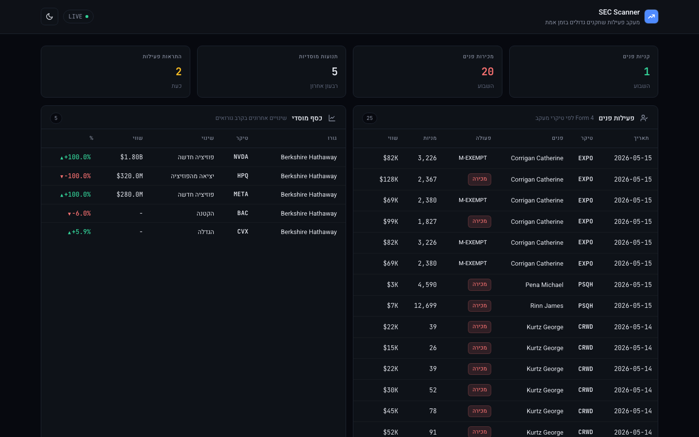

# SEC Scanner

> Track what big institutional investors, hedge fund managers, and corporate insiders are actually doing - directly from SEC filings. Runs locally inside Claude Code. Hebrew RTL dashboard, Excel + PDF + newsletter outputs. Free tier data sources.
>
> מערכת מעקב אחרי קרנות גדולות, מנהלי השקעות בכירים, ופעולות פנים בחברות ציבוריות בארה"ב - ישירות מתוך דיווחי SEC. רץ מקומית בתוך Claude Code. דשבורד בעברית, פלטי Excel + PDF + ניוזלטר. מבוסס על שכבת המידע החינמית של המקורות.

   [](https://github.com/peleg-jpg/sec-scanner/actions/workflows/verify.yml)



---

## What it does | מה זה עושה

Pulls from three public data sources via Claude Code:

- **EdgarTools MCP** - SEC EDGAR direct (13F, Form 4, 13D/G, DEF 14A, 10-K, NPORT, full-text)
- **Institutional Flow Tracker skill** - tier-weighted superinvestor signals (Buffett, Burry, Ackman, etc.)
- **GuruFocus MCP** (optional) - pre-computed guru scores + cross-screen

Outputs:

| Output                    | Tech                             | Use                                       |
| ------------------------- | -------------------------------- | ----------------------------------------- |
| Hebrew RTL HTML dashboard | vanilla JS, no build step        | open in browser, refresh after every pull |
| Excel `.xlsx` per guru    | openpyxl                         | quarterly comparison spreadsheets         |
| PDF reports               | Chrome headless (no system deps) | weekly snapshots                          |
| Markdown newsletter       | jinja2                           | email-ready Hebrew brief                  |
| Terminal screener         | colorama                         | morning print-out in zsh                  |

---

## Disclaimer | אזהרה משפטית

> **English:** Public-information aggregator. Not investment advice. No recommendations. Use at your own risk.
>
> **עברית:** מציג מידע ציבורי בלבד. אין כאן ייעוץ השקעות, המלצות, או חוות דעת. כל החלטה היא באחריותך בלבד.

Full Hebrew legal text: [`legal/disclaimer-he.md`](legal/disclaimer-he.md).

---

## Requirements | דרישות

| Tool                               | Why                                              | How to get it                                                       |
| ---------------------------------- | ------------------------------------------------ | ------------------------------------------------------------------- |
| **Claude Code CLI**                | core orchestrator + slash commands               | https://docs.claude.com/en/docs/claude-code/quickstart              |
| **Python 3.11+**                   | renderers (dashboard / Excel / PDF / newsletter) | `brew install python`                                               |
| **Google Chrome**                  | headless PDF rendering (no system libs needed)   | https://www.google.com/chrome/                                      |
| **git**                            | clone this repo                                  | usually pre-installed on macOS                                      |
| **FMP free API key**               | required for Institutional Flow Tracker skill    | https://site.financialmodelingprep.com/register (free, 250 req/day) |
| **Google account**                 | required for EdgarTools OAuth (browser sign-in)  | any Google account                                                  |
| **GuruFocus account** _(optional)_ | optional MCP for guru scores                     | https://www.gurufocus.com/                                          |

Tested on macOS Apple Silicon. Linux + WSL should work but not verified.

---

## Quick start | התחלה מהירה

### 1. Clone

```bash
git clone https://github.com/YOUR_USERNAME/sec-scanner.git
cd sec-scanner
```

### 2. Get your FMP key

1. Sign up free: https://site.financialmodelingprep.com/register
2. Open the dashboard: https://site.financialmodelingprep.com/developer/docs/dashboard
3. Copy your API key

### 3. Configure env

```bash
cp install/.env.example .env
```

Open `.env` and fill in:

```dotenv
FMP_API_KEY=your_fmp_key_here
EDGAR_IDENTITY="Your Name your.email@example.com"
# optional
GURUFOCUS_API_KEY=your_gf_key_here
```

`EDGAR_IDENTITY` is required by the SEC fair-access policy: they need a User-Agent identifying who is making API calls. Use your real name + email - it is not authenticated, just logged.

### 4. Install the MCPs and the skill

```bash
bash scripts/setup.sh
```

This will:

- Register the EdgarTools remote MCP with Claude Code (`claude mcp add edgar_tools ...`)
- Clone the `institutional-flow-tracker` skill from [tradermonty/claude-trading-skills](https://github.com/tradermonty/claude-trading-skills) into `~/.claude/skills/`
- Verify prereqs are present

### 5. (Optional) Register the GuruFocus MCP

If you have a GuruFocus account:

```bash
claude mcp add gurufocus \
  --transport http https://api.gurufocus.com/mcp \
  --header "Authorization: Bearer $GURUFOCUS_API_KEY"
```

### 6. Sanity-check the install

```bash
source .env
bash scripts/verify.sh
```

You should see 5 green `[PASS]` lines. If any fail, the script tells you what to fix.

### 7. First EdgarTools OAuth

The first time you call EdgarTools MCP, Claude Code will open your default browser asking you to sign in to `app.edgar.tools` with Google. One-time sign-in. After that, the OAuth token is cached in `~/.claude.json`.

---

## Using it | שימוש

### Inside Claude Code (slash commands)

Open Claude Code from the project root:

```bash
cd sec-scanner
claude
```

Available slash commands (load automatically from `.claude/commands/`):

| Command                                  | What it does                                                                       |
| ---------------------------------------- | ---------------------------------------------------------------------------------- |
| `/insider-watch`                         | Pulls Form 4 trades for tickers in `data/watchlist.json` → `insider_watch`         |
| `/flow-track {guru_id}`                  | Pulls latest 13F + Flow Tracker signals. Example: `/flow-track berkshire_hathaway` |
| `/portfolio-diff {guru} {from_q} {to_q}` | Compares two quarters. Example: `/portfolio-diff berkshire_hathaway 2025Q4 2026Q1` |
| `/morning-brief`                         | Daily orchestrator: insider + 13F + signals → top 5 Hebrew summary                 |
| `/weekly-newsletter`                     | Aggregates last 7 days into 5-10 Hebrew highlights                                 |

Each writes JSON to `data/snapshots/` matching [`SCHEMAS.md`](SCHEMAS.md). Renderers in `outputs/` then consume the JSON.

### Outside Claude Code (live pull)

If you don't want to open Claude Code, there is a Python script that bypasses MCPs and calls the FMP REST + SEC EDGAR directly:

```bash
source .env
python3 scripts/live-pull.py
```

It pulls the latest 100 insider filings (FMP free tier limit) and the latest 13F metadata for each guru in your watchlist.

### Generate the dashboard

```bash
# 1. Start the local server (runs in background until you kill it)
python3 -m http.server 8080 --directory outputs/dashboard --bind 127.0.0.1 &

# 2. Render JSON from snapshots
python3 outputs/dashboard/render.py

# 3. Open the dashboard
open http://127.0.0.1:8080
```

Refresh the browser any time you re-run `render.py`.

### Generate a PDF report

```bash
bash scripts/pdf.sh
```

This runs a full pipeline: live-pull → render → Chrome-headless screenshot → opens PDF in Preview.

### Generate Excel / Markdown newsletter

```bash
python3 outputs/excel/generate.py        # per-guru .xlsx
python3 outputs/newsletter/render.py     # markdown newsletter
python3 outputs/screener/daily.py        # terminal table
```

Outputs land in `outputs/excel/` and `data/reports/`.

---

## Customize your watchlist | התאם את ה-Watchlist

Edit [`data/watchlist.json`](data/watchlist.json):

```json
{
  "tickers": ["AAPL", "NVDA", "TSLA", "MSFT", "GOOG"],
  "gurus": [
    {
      "id": "berkshire_hathaway",
      "cik": "0001067983",
      "display": "Berkshire Hathaway"
    },
    { "id": "michael_burry", "cik": "0001649339", "display": "Michael Burry" },
    {
      "id": "bill_ackman",
      "cik": "0001336528",
      "display": "Bill Ackman / Pershing"
    }
  ],
  "insider_watch": ["TSLA", "NVDA", "META", "AAPL", "MSFT"]
}
```

Find a guru's CIK at https://www.sec.gov/cgi-bin/browse-edgar?action=getcompany.

---

## Project structure | מבנה הפרויקט

```
sec-scanner/
├── README.md                   ← this file
├── SCHEMAS.md                  ← JSON contract between slash commands and renderers
├── LICENSE                     ← MIT
├── .gitignore                  ← protects .env + generated artifacts
├── install/                    ← per-component install scripts + env template
│   ├── 01-edgartools-mcp.sh
│   ├── 02-flow-tracker-skill.sh
│   ├── 03-env-setup.md         ← Hebrew + English walkthrough
│   └── .env.example
├── scripts/
│   ├── setup.sh                ← run both installs + prereq check
│   ├── verify.sh               ← 5-check sanity test
│   ├── live-pull.py            ← bypass MCPs, hit FMP + SEC REST directly
│   └── pdf.sh                  ← end-to-end: pull → render → Chrome PDF
├── .claude/
│   └── commands/               ← Claude Code slash commands (5)
├── workflows/README.md         ← per-command notes
├── outputs/                    ← renderers
│   ├── dashboard/              ← Hebrew RTL HTML dashboard (vanilla JS)
│   ├── excel/                  ← openpyxl per-guru sheets
│   ├── pdf/                    ← weasyprint (legacy, needs system libs)
│   ├── newsletter/             ← jinja2 markdown
│   └── screener/               ← terminal colorama table
├── data/
│   ├── watchlist.json          ← editable: tickers + gurus + insider_watch
│   ├── snapshots/              ← JSON written by slash commands / live-pull
│   └── reports/                ← generated PDFs + newsletters (gitignored)
└── legal/disclaimer-he.md      ← Hebrew legal text
```

---

## Limits worth knowing | מגבלות שחשוב להכיר

- **45-day 13F lag** - institutional 13F filings publish up to 45 days after quarter-end. Every 13F snapshot includes a `filing_date` field.
- **Insiders sell for many reasons** - tax planning, exercise of options, scheduled 10b5-1. A sell is not a bearish signal by itself.
- **FMP free tier** - 250 requests/day, `page=0` only on paginated endpoints, no 13F positions on free tier.
- **EdgarTools free tier** - 100 requests/day on the hosted MCP. Self-host the local `uvx edgartools-mcp` for unlimited.
- **GuruFocus free tier** - browse-only on web. MCP access depends on plan.
- **Public information only** - the system does not use insider information, leaked filings, or anything not already publicly available.

---

## Troubleshooting | פתרון תקלות

| Problem                                      | Fix                                                                                |
| -------------------------------------------- | ---------------------------------------------------------------------------------- |
| `claude mcp list` doesn't show `edgar_tools` | Re-run `bash install/01-edgartools-mcp.sh` from project root                       |
| `FMP_API_KEY missing`                        | `source .env` before running scripts                                               |
| EdgarTools OAuth stuck                       | Manually open the URL printed by Claude Code, sign in, return to terminal          |
| Dashboard tab blank                          | Check `python3 -m http.server` is still running, refresh, look at browser console  |
| PDF script says "Chrome not found"           | Install Google Chrome from https://www.google.com/chrome/                          |
| WeasyPrint errors about `libgobject`         | Skip it - the `scripts/pdf.sh` uses Chrome headless instead, no system libs needed |

---

## Roadmap | מפת דרכים

- [ ] Parse 13F XML to populate real `positions` arrays (right now `holdings-*.json` from live-pull is metadata-only)
- [ ] Cron scheduling templates for daily morning brief + Friday newsletter
- [ ] Webhook → Telegram / Slack alerts
- [ ] Vercel deploy for the dashboard (currently localhost-only)
- [ ] English locale toggle for the dashboard
- [ ] Cover Form 4 statistics endpoint (currently FMP paid-tier only)

---

## Contributing

PRs welcome. Open an issue first for anything bigger than a typo. All Hebrew strings reviewed for casual Israeli style - avoid literary/formal vocabulary on user-facing text.

---

## Credits

- **EdgarTools** by [@dgunning](https://github.com/dgunning) - https://github.com/dgunning/edgartools
- **Institutional Flow Tracker skill** by [@tradermonty](https://github.com/tradermonty) - https://github.com/tradermonty/claude-trading-skills
- **Claude Code** by Anthropic - https://docs.claude.com/en/docs/claude-code
- **Financial Modeling Prep** - https://site.financialmodelingprep.com
- **SEC EDGAR** - the actual public data source - https://www.sec.gov/edgar

---

## License

MIT. See [LICENSE](LICENSE).

---

## Not affiliated with

SEC, FMP, GuruFocus, Anthropic, EdgarTools, Berkshire Hathaway, or any guru/fund mentioned in the data. This is an independent integration of public data sources.
